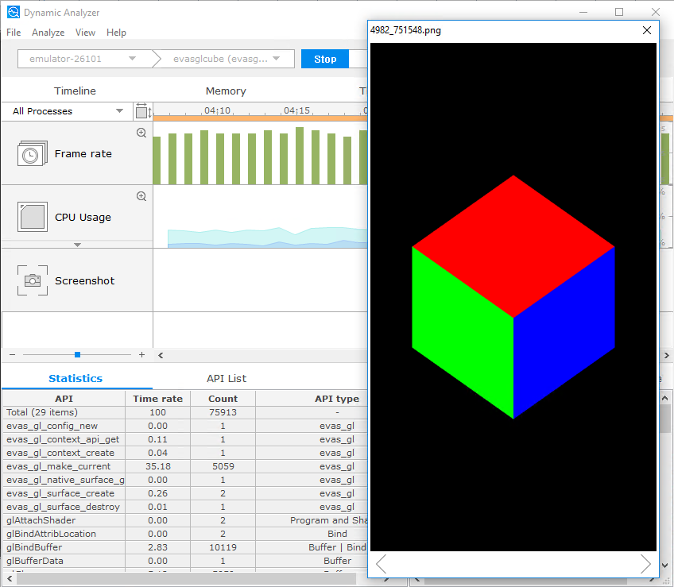
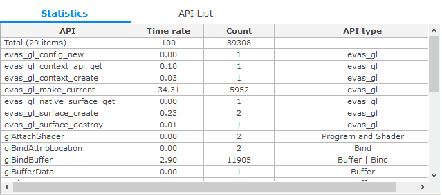
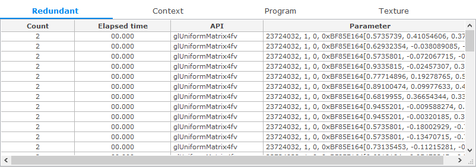
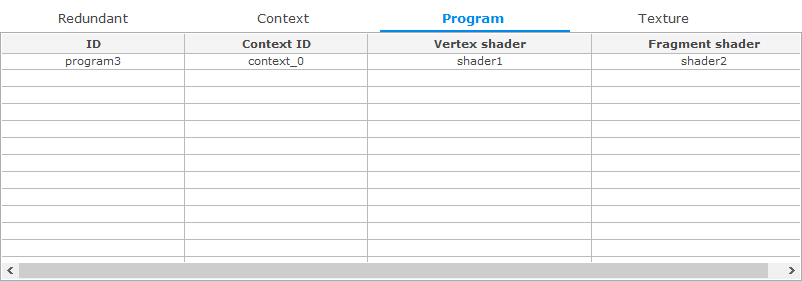

# Performing OpenGL Analysis

# Dependencies

- Tizen Studio 1.0 and Higher

The **OpenGL ES** (Open Graphics Library) tab of the Dynamic Analyzer displays information about OpenGL® 2.0 and EvasGL.

The tab consists of the following views:

- [OpenGL chart](#chart) shows the elapsed time of the frame.
- [Statistics](#statistics) table displays statistics of APIs related to EvasGL and OpenGL®.
- [API List](#api_list) table shows the OpenGL® APIs that are associated with the values selected in the OpenGL chart.
- [Redundant](#redundant) table displays the APIs that are called repeatedly with the same parameters.
- [Context](#context) table displays the render state of the API context selected in the API List table.
- [Program](#program) table shows the shader program information.
- [Texture](#texture) table shows texture information.

**Figure: OpenGL analysis**

## OpenGL Chart

The OpenGL chart displays the elapsed frame time with 2 charts:

- The Frame time chart shows the elapsed frame time. The X axis value of the frame time chart is the frame index number. A smaller chart value indicates a better status frame. Only frames smaller than the value specified by the user and changed to yellow are visible.

  **Figure: Frame time chart**

  

- The Frame rate chart shows the FPS. The X axis value of the frame rate chart is the analysis time. A larger chart value indicates a better status frame.

  **Figure: Frame rate chart analysis**

  

## Statistics

The Statistics table displays the API statistics related to EvasGL and OpenGL® 2.0.

**Figure: Statistics table**

The table contains the following columns:

- **API** (text): API name
- **Time rate** (long): Rate of the API that was called
- **Count** (integer): Number of times the API was called
- **API type** (text): What the API operates on and how

## API List

The API List table displays the APIs associated with the values selected in the chart.

**Figure: API List table**

The table contains the following columns:

- **#** (integer): Unique log index
- **Frame**: Frame index number
- **Time** (time): Time when the API was called
- **API** (text): API name
- **Parameter**: Input parameter of the API
- **Return**: Return value of the API
- **Elapsed time** (time): Time to return after the call
- **Error** (text): Error description of the API; a normal end return is **GL_SUCCESS**
- **PID** (integer): API process ID
- **TID** (integer): API thread ID

## Redundant

The Redundant table displays the APIs that are called repeatedly with the same parameters.

**Figure: Redundant table**

The table contains the following columns:

- **Count** (integer): Number of times the API was called
- **Elapsed time** (time): Time to return after the call
- **API** (text): API name
- **Parameter**: Input parameters of the API

## Context

The Context table displays the context rendering state associated with the item selected in the API List table. The title of the table refers to the context number of the selected API.

**Figure: Context table**

The table contains the following columns:

- **Name** (text): State name
- **Default state** (text): Initial state value when the program is started
- **Current state** (text): Current state value

Compare the **Default state** and **Current state** values to see the changes. The yellow color represents a changed state.

## Program

The Program table displays the program information associated with the items selected in the API List table.

**Figure: Program table**

The table contains the following columns:

- **ID** (text): Program ID of the context
- **Context ID** (text): Context name
- **Vertex shader** (text): Vertex shader ID of the program
- **Fragment shader** (text): Fragment shader ID of the program

The same ID cannot be replicated in a context.

## Texture

The Texture table displays the textures associated with the item selected in the API List table.

**Figure: Texture table**

The table contains the following columns:

- **Context ID** (text): Context name
- **ID** (text): Texture ID of the context
- **Type** (text): Render state value of the texture type
- **WRAP_S** (text): Render state value of the WRAP_S texture
- **WRAP_T** (text): Render state value of the WRAP_T texture
- **MIN_FILTER** (text): Render state value of the MIN_FILTER texture
- **MAG_FILTER** (text): Render state value of the MAG_FILTER texture