# Tizen Studio Migration Guide(From Tizen SDK to Tizen Studio)
## Dependencies

- Tizen Studio 1.0 and Higher

This topic gives instructions for migrating your old Tizen SDK to the Tizen Studio. If you follow the instructions, your development environment is migrated without problems and you can start developing with the new Tizen Studio.

**Note**
If the Tizen certificates (author and distributor) are removed during the uninstallation, you cannot issue the same ones again to update your existing applications. Back up your certificates!Your projects used in the Tizen SDK can be imported to the Tizen Studio. Do not uninstall the Tizen SDK before you have imported them to the Tizen Studio after a successful installation.Emulator images made in the Tizen SDK cannot be migrated to the Tizen Studio. After installing the Tizen Studio, you can make a new emulator for each platform.

To migrate from the Tizen SDK to the Tizen Studio:

1. Back up your author and distributor certificates in the old Tizen SDK.
2. Install the Tizen Studio, which includes development environments for the 2.3.0, 2.3.1, 2.3.2, and 2.4 platforms.
3. Restore your certificates in the Tizen Studio.
4. Import your projects to the Tizen Studio.
5. Uninstall your old Tizen SDK.

## Backing up Certificates

Backing up your author (`author.p12`) and distributor (`distributor.p12`) certificates is a very important process for maintaining your applications.

When you update your applications, which are already published at the seller site ([seller.samsungapps.com](http://seller.samsungapps.com)), the update must be signed with the same author certificate as the original application. If the applications are signed with different author certificates, the update can be recognized as a different application and not an update.

Back up the certificates in your own secure place. (When you delete the existing Tizen SDK, the certificates can be removed in the process.)

To keep your certificates safe, find the following author and distributor certificates, and move them to a safe location:

- Ubuntu and macOS:
  - `/home/<user>/<TIZEN-SDK-DATA>/keystore/author.p12`
  - `/home/<user>/<TIZEN-SDK-DATA>/keystore/distributor.p12`
- Windows®:
  - `C:\<TIZEN-SDK-DATA>\keystore\author.p12`
  - `C:\<TIZEN-SDK-DATA>\keystore\distributor.p12`

## Installing the Tizen Studio

**Note**Make sure that your installation location is empty.

To install Tizen Studio:

1. Launch the Tizen Studio installer.

   

2. Check and accept the license terms.

   

3. Set the SDK and data location, and install the Tizen Studio.

   If your default location is already in use, click the **…** button in the **SDK location** field, and select an empty location.

   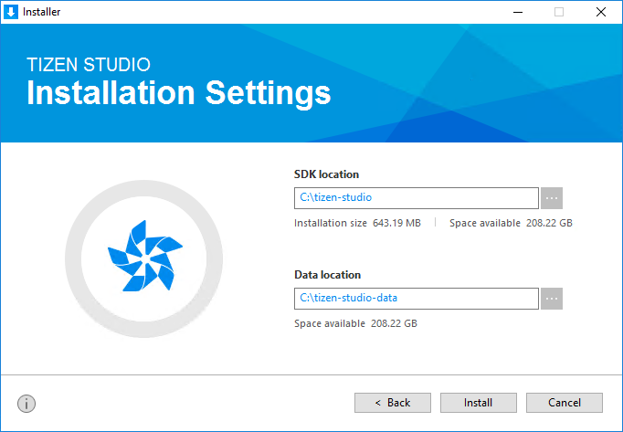

4. Launch the Package Manager to install additional development environment packages.

   Select the checkbox and click **Finish** to launch the Tizen Studio Package Manager.

   

5. Install additional development environment packages, as needed.

   Click **install** next to the development environments you want to install. To use an existing workspace or project, you must install the development environment for that version and profile.

   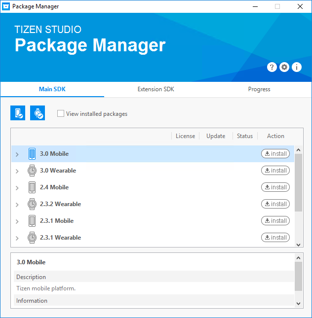

## Restoring Certificates

If you already have both certificate files, you can import and use them to sign your applications:

1. In the Tizen Studio menu, go to **Tools > Certificate Manager**.
2. Click the **+** button.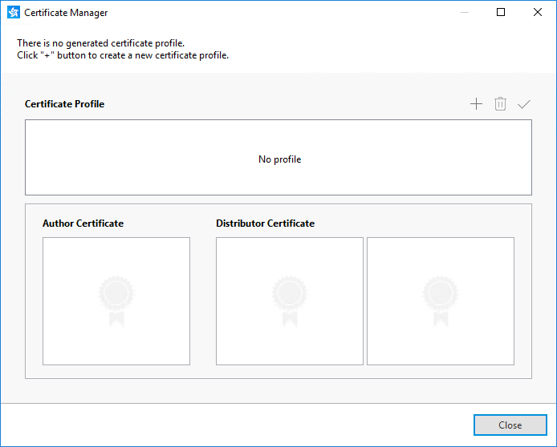
3. Enter the certificate profile name and click **Next**.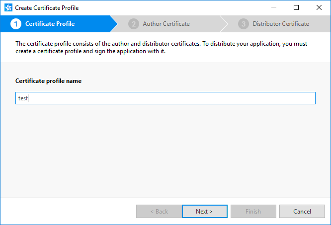
4. Select the **Select an existing author certificate** radio button and click **Next**.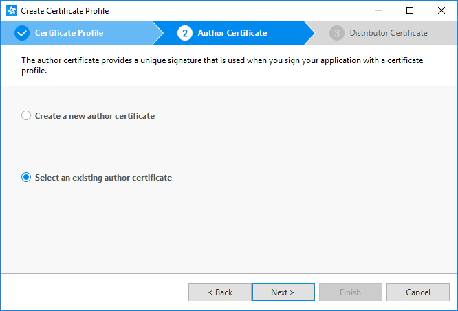
5. Click **Browse** and select your author certificate file.Enter the password and click **Next**.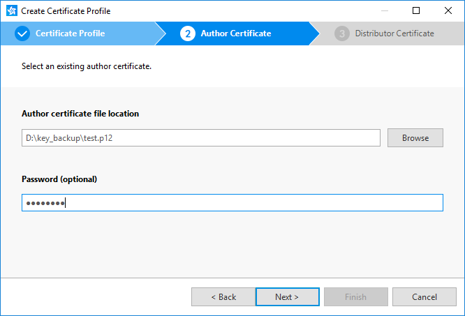
6. Select the **Select a distributor certificate for another app store** radio button, and click **Next**.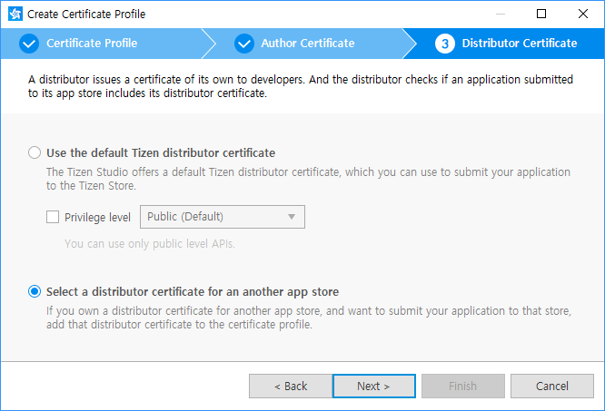
7. Click **Browse** and select your distributor certificate file.Enter the password and click **Finish**.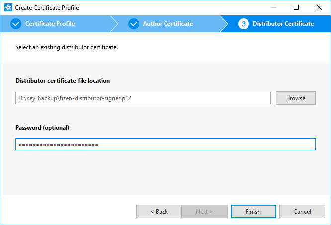
8. When the certificate import is ready, a confirmation popup is shown. Click **OK** to close the popup.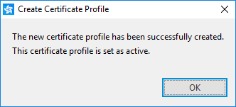Your certificate profile is displayed in the Certificate Manager.

## Importing Projects to the Tizen Studio

To import old Tizen SDK projects to new Tizen Studio projects:

1. Launch the Tizen Studio from **Start > Tizen Studio > Tizen Studio**.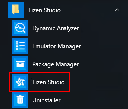

2. Create a new workspace.

   **Note**Reusing the existing workspace is not recommended.

   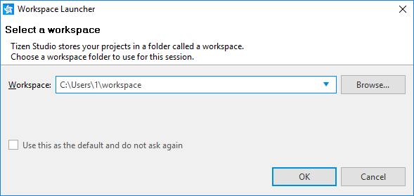

3. In the Tizen Studio menu, go to **File > Import**.

4. Select **Tizen > Tizen Project**, and click **Next**.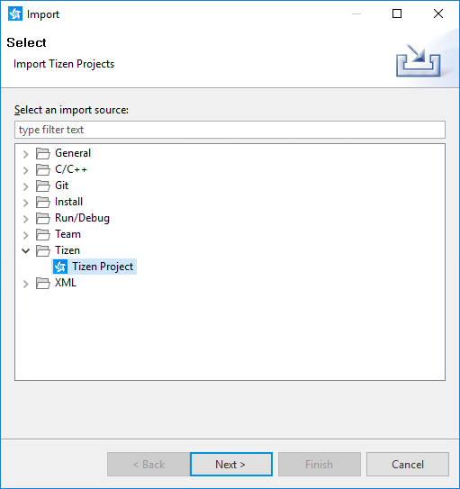

5. In the conversion wizard:

   1. In the **Select root directory** field, click **Browse** and select the root directory of the previous projects for import.

   2. In the **Projects** pane, select the projects to import.

   3. Define the platform and version of the projects.

      To simply rebuild the applications, select the same profile and platform version. To convert the projects to support other profiles and platform versions, change the platform options.

   4. To copy your projects to the new workspace folder, select the **Copy projects into workspace** checkbox.

   5. Click **Finish**.

   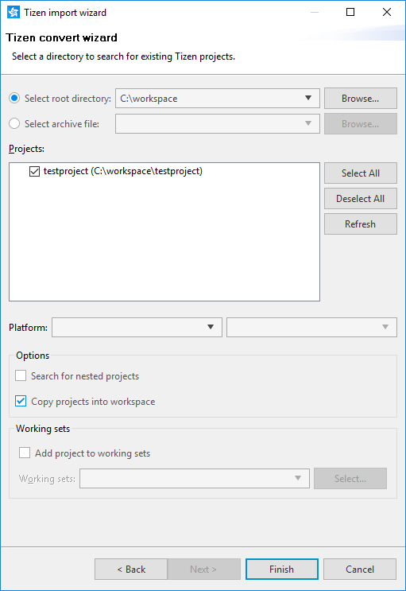

6. Check the imported projects in the **Project Explorer** view.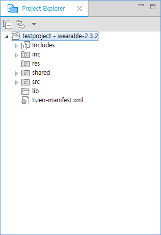

## Uninstalling the Legacy Tizen SDK

You can uninstall the Tizen SDK using the Uninstaller tool, or by manually deleting the following directories (assuming that you had installed the SDK to the default directory):

- Ubuntu and macOS:
  - `/home/<user>/<TIZEN_SDK>`
  - `/home/<user>/<TIZEN_SDK_DATA>`
- Windows®:
  - `C:\<TIZEN_SDK>`
  - `C:\<TIZEN_SDK_DATA>`

Your Tizen authorization files (author and distributor certificates) exist in the `<TIZEN_STUDIO>` directory. You cannot update your existing applications on the Tizen Store if you delete these files without backing them up first.

Some components do not get deleted automatically (such as shortcuts and install logs) and must be deleted manually.