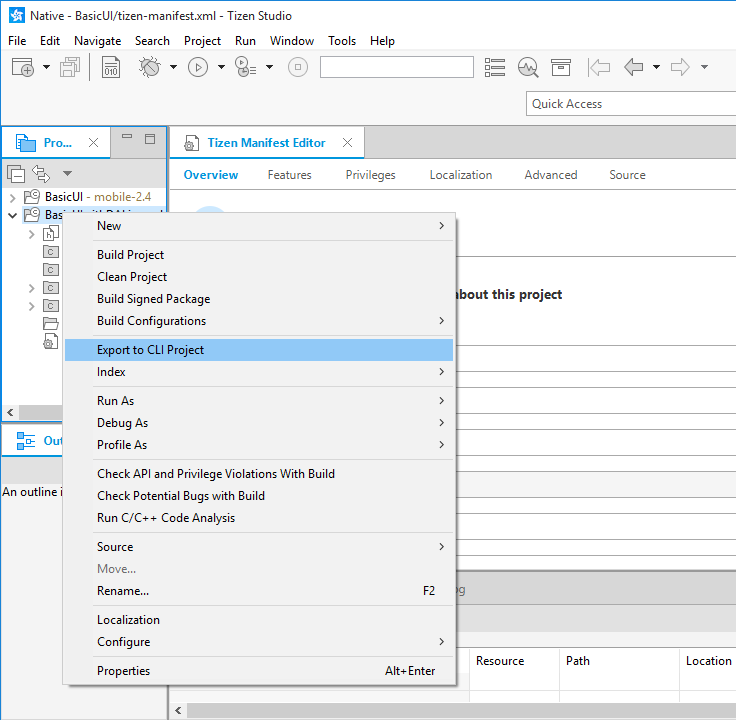

# Converting Projects for CLI
## Dependencies

- Tizen Studio 1.0 and Higher


You can build a project, originally created with the Tizen Studio, using the Command Line Interface (CLI).

## Building a Tizen Studio Project on the CLI

To build a Tizen Studio project on the CLI, you must convert the project to a CLI project:

1. In the Tizen Studio, open the project you want to convert.
2. Right-click the project and select **Export to CLI Project**.An info dialog appears, and the `project_def.prop` and `build_def.prop` files and the `Build` directory are created.

The Tizen Studio and CLI differ in how they describe the project properties and build configuration. The CLI uses the `project_def.prop` file for the project properties and the `build_def.prop` file for the build configurations. During export, the `project_def.prop`, `build_def.prop`, and the makefiles are added to the converted CLI project automatically.

**Figure: Project conversion**



## About the project_def.prop File

The `project_def.prop` file describes the project properties, such as project type and list of source files. When you edit the properties in the `project_def.prop` file to manipulate the build or packaging process, use the following characters:

- "/" is a path separator character (in Windows®, Ubuntu, and macOS).
- "\" is a multi-line character, which is used at the end of each line.
- "\ " (backslash + space) is a space character, used in a path name that contains a space.
- "#" is a comment character.

**Table: Project properties**

| Property               | Value                                    |
| ---------------------- | ---------------------------------------- |
| `APPNAME`              | Application name, which must be given in lowercase letters. </br>For example: `APPNAME = test` |
| `type`                 | Application type, which can be app, sharedLib, or staticLib.</br>For example: `type = app`</br>This is a **readonly** property; do not edit it. |
| `profile`              | Profile with a version. </br>For example: `profile = mobile-2.3` |
| `USER_SRCS`            | List of `.c` and `.cpp` source files in the current project.</br>The list can be used with wildcard characters: *.</br>If there are more than 2 files, a white-space character separator is used.</br>For example: `USER_SRCS = src/*.c` |
| `USER_DEFS`            | List of user-defined C files added to the compilation process.The list must be used without the `-D` characters for the C compiler.</br>For example: `USER_DEFS = ABC DEF` |
| `USER_UNDEFS`          | List of user-defined C files excluded from the compilation process.</br>The list must be used without the `-U` characters for the C compiler. |
| `USER_CPP_DEFS`        | List of user-defined C++ files added to the compilation process.</br>The list must be used without the `-D` characters for the C++ compiler. |
| `USER_CPP_UNDEFS`      | List of user-defined C++ files excluded from the compilation process.</br>The list must be used without the `-U` characters for the C++ compiler. |
| `USER_LIBS`            | List of library paths added to the linking process.</br>The list must be used without the `-l` characters. |
| `USER_OBJS`            | List of the `.o` file paths added to the linking process.</br>An absolute path can be available. |
| `USER_INC_DIRS`        | List of reference paths for C and C++ compiling.</br>The list must be used without the `-I` characters.</br>For example: `USER_INC_DIRS = inc`</br>An absolute path can be available. |
| `USER_INC_FILES`       | List of `.h` file paths for C.</br>The list must be used without the `-include` characters. An absolute path can be available. |
| `USER_CPP_INC_FILES`   | List of `.h` file paths for C++.</br>The list must be used without the `-include` characters. An absolute path can be available. |
| `USER_LIB_DIRS`        | List of reference paths for the library linking.</br>The list must be used without the `-L` characters. An absolute path can be available. |
| `USER_EDCS`            | List of `.edc` file paths.</br>The list can be used with wildcard characters, such as `*`.</br>If there are more than 2 files, a white-space character separator is used.</br>For example: `USER_EDCS = res/edje/*.edc` |
| `USER_EDCS_IMAGE_DIRS` | List of EDC reference paths for compiling, such as the `-id` option of the Tizen Studio. </br>An absolute path can be available. |
| `USER_EDCS_SOUND_DIRS` | List of EDC reference paths for compiling, such as the `-sd` option of the Tizen Studio. </br>An absolute path can be available. |
| `USER_EDCS_FONT_DIRS`  | List of EDC reference paths for compiling, such as the `-fd` option of the Tizen Studio. </br>An absolute path can be available. |
| `USER_POS`             | List of `.po` file paths.</br>The list can be used with wildcard characters, such as *.</br>If there are more than 2 files, a white-space character separator is used.</br>For example: `USER_POS = res/po/*.po` |

## About the build_def.prop File

The `build_def.prop` file describes some build configurations. You can run pre-build and post-build commands by describing the following properties.

**Table: Build properties**

| Property            | Description                              |
| ------------------- | ---------------------------------------- |
| `PREBUILD_COMMAND`  | Shell command executed before the project build. |
| `PREBUILD_DESC`     | Description of `PREBUILD_COMMAND`.       |
| `POSTBUILD_COMMAND` | Shell command executed after the project build. |
| `POSTBUILD_DESC`    | Description of `POSTBUILD_COMMAND`.      |

In addition, you can use some environment variables to describe the pre- and post-build commands.

**Table: Environment variables**

| Variable       | Description                              |
| -------------- | ---------------------------------------- |
| `PROJ_PATH`    | Path of the project root directory       |
| `BUILD_CONFIG` | Build configuration: `Debug` or `Release` |
| `BUILD_ARCH`   | Architecture type: `x86` or `arm`        |

For example:

```
# Adding pre/post build command to build_def.prop
PREBUILD_COMMAND = mkdir ${PROJ_PATH}/${BUILD_CONFIG}/${BUILD_ARCH}/output
PREBUILD_DESC = Creating the output directory
POSTBUILD_COMMAND = rm -rf ${PROJ_PATH}/${BUILD_CONFIG}/${BUILD_ARCH}/tmp
POSTBUILD_DESC = Clean up the temporary resources
```